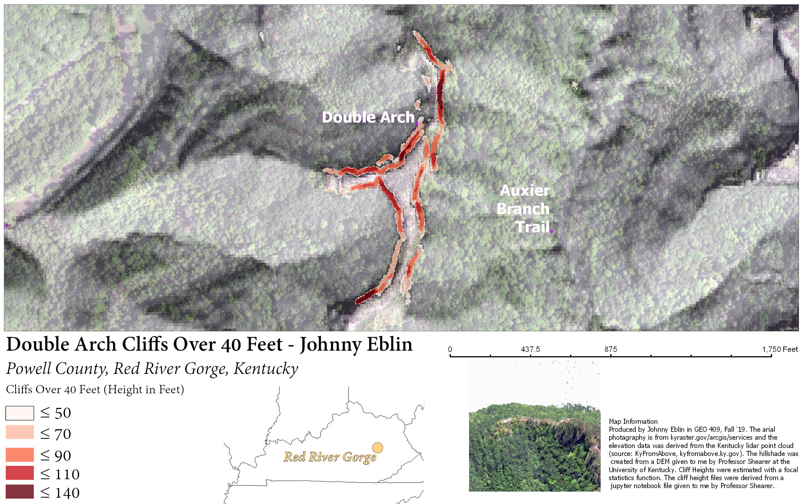

# Lab 7 Outputs
## Johnny Eblin - UKY GEO 409

  
The map above details cliff height values around Double Arch in the Red River Gorge. For this dataset, only arches above 40 feet were considered. The smallest arch in the dataset is just above 50 feet and the largest arch is 140 feet tall.

  
Double Arch flyover in the Red River Gorge