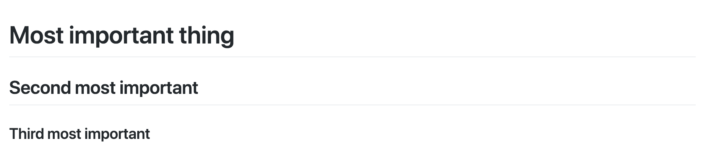
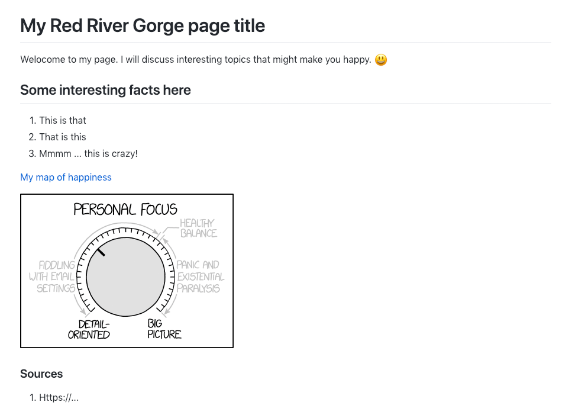

# Lab 01: Working with common file formats in GitHub Repositories

This lab assignment builds from the material and processes covered in lesson 01. Please complete the lesson before continuing.

## Table of Contents

<!-- TOC -->

- [Lab 01: Working with common file formats in GitHub Repositories](#lab-01-working-with-common-file-formats-in-github-repositories)
    - [Table of Contents](#table-of-contents)
    - [First steps in writing code](#first-steps-in-writing-code)
        - [Example with headings](#example-with-headings)
        - [Comments](#comments)
    - [Part I. Creating new Markdown content in your repository (4 pts)](#part-i-creating-new-markdown-content-in-your-repository-4-pts)
    - [Part II. Creating an Red River Gorge map (6 pts)](#part-ii-creating-an-red-river-gorge-map-6-pts)
        - [Steps](#steps)
        - [URLs, default documents, and file surfacing on GitHub.io and GitHub.com](#urls-default-documents-and-file-surfacing-on-githubio-and-githubcom)
    - [Challenge (+1 pt)](#challenge-1-pt)
    - [Submission](#submission)

<!-- /TOC -->

## First steps in writing code

You will create and edit content in two formats; a Markdown formatted file and an HTML (Hyper Text Markup Language) file. Both of these formats are *markup* coding languages which use reserved character strings (sometimes called *keywords* or *reserved words*) to represent formatting and page structure, e.g., `<p>I am a paragraph element in HTML.</p>`

The goal is to recognize code *syntax*, i.e., what parts of text are content and what parts are keywords. In the above example, the `<p></p>` are tags that tell the browser to display the content as a paragraph block. This will be an essential skill when you start working with code in earnest. If you've completed the lesson, you already have a good text editor that will *highlight* code syntax with unique colors and help you recognize patterns to better understand it.

### Example with headings

Let's say we want to present a hierarchy of information in a document like the example. We call these page *headings* with larger headings implying greater rank or significance of content in a page.



You probably have done this type of formatting many times in popular desktop word processing programs. You highlight the desired text with your mouse, click a menu item, apply a style, and viola! the item is now magically formatted.

That's fine and good, but what if you are creating content that changes often? Do you want to go into your program and reapply the formatting every time? Or, if your program can't handle the file size or complexity of the content you are creating?

Enter text-based workflows, aka writing code. In markup languages, characters represent content or they represent structure/formatting.

In Markdown you would use the hashtag `#` character as shown in the following code to show page hierarchy:

```md
# Heading 1
## Heading 2
### Heading 3
```

The `#` character formats the following characters (as the above example) and is **not shown** when the page renders in your browser.

To achieve the same results in HTML, the heading content is wrapped in opening and closing *tags*. Notice that the opening and closing tags `<h1></h1>` differ in only the `/` forward slash character.

```markdown
<h1>Heading 1</h1>
<h2>Heading 2</h2>
<h3>Heading 3</h3>
```

In HTML, we call the content inside the `<h1></h1>` a heading one *element*. Elements can be parsed to understand and modify a page's structure and content. This is a powerful dimension in web design and programming that we'll leave for another course.

To summarize, when a web browser renders code into pretty pages, the content is modified by other characters that have defined rules for formatting and are not displayed in the browser. Thus, we have two sides to a document; the rendered side that the public sees and the code side in which you create content. In our workflow, the GitHub.com domain shows us the code side while the GitHub.io domain shows the rendered side.

### Comments

There is one set of characters that every language uses to help the reader understand the author's intention; comments are an important part of the writing process. In both Markdown and HTML, the following character set defines a comment `<!-- -->`, which is neither rendered in the browser or executed as code.

```md
<!-- I am a comment in Markdown and HTML -->
<!-- 
    Use me often to explain your intention.
    Good comments will help you understand what
    you were thinking when you revisit your project.
-->
```

## Part I. Creating new Markdown content in your repository (4 pts)

[Markdown](https://en.wikipedia.org/wiki/Markdown) is by far the easiest way to create consistently well-formatted documentation. It was created in 2004 and the original authors had the goal of enabling people "to write using an easy-to-read and easy-to-write plain text format, optionally convert it to structurally valid" HTML. In our workflow, we're are using Markdown to easily write simple HTML.

 As you work through this section, look at GitHub's [Markdown Cheatsheet](https://github.com/adam-p/markdown-here/wiki/Markdown-Cheatsheet) to understand how to format your content. Create a new folder called "info" in your *rrg* repo and then a file named "readme.md" within the *info* folder. The directory path should be similar to: *rrg/info/readme.md* directory,

Complete the following in your new *readme.md* file:
1. Add a title to your page using an Heading 1 tag (`#`).
2. Do a little research about the Red River Gorge and describe two facts about this area. 
3. Put a Heading 2 tag (`##`) with a good title before each text block.
4. Provide one link to an interesting map you find online.
5. Add one photograph.
6. Add your name and the sources you used for reference.

Within this markdown file, be able to tell the different between content about the Red River Gorge and the code/instructions that tell GitHub how to render the look and interactivity of the content to the browser.

For example, consider this Markdown syntax:

```markdown
<!-- Heading 1 -->
# My Red River Gorge page title

<!-- First paragraph -->
Welcome to my page. I will discuss interesting topics that might make you happy. 😃

<!-- Heading 2 -->
## Some interesting facts here

<!-- Ordered list -->
1. This is that
2. That is this
3. Mmmm ... this is crazy!

<!-- Link to web page -->
[My map of happiness](https://ourworldindata.org/grapher/happiness-cantril-ladder)

<!-- Display PNG image from a different server. Notice the exclamation mark ! -->


<!-- 
    This is a comment. The above line grabs a PNG from a URL and will display it as an image. The "Become Happy" text inside the brackets is called an Alt property and is used in case the image is corrupted or for browsers that don't display images (they exist). 
-->

<!-- Heading 3 -->
### Sources
1. Https://...
```

When it is placed inside a GitHub web server, it will render to this: 

<hr>



<hr>

## Part II. Creating an Red River Gorge map (6 pts)

[HTML](https://en.wikipedia.org/wiki/HTML) (Hyper Text Markup Language) has been around since the early days of the World Wide Web and today is the language that describes the page structure and content to a web browser. It is used with CSS (Cascading Style Sheets) and JavaScript to give the experience you enjoy everyday in your browser. 

In this section you'll edit an HTML page to display an interactive map, briefly describe an interesting fact about the Red River Gorge, and compare the task of writing content in Markdown to writing in HTML. Don't worry if the HTML code looks alien. Our goal is to be able to recognize code from content and be able to edit/hack small portions to achieve a desired effect.

### Steps

First, copy the *index.html* file in this folder over to your *rrg* folder in your *github.com/username/rrg* repository you created in the lesson. Then, make the following edits to the file. Use the Live Server extension in VS Code to preview your work. Commit changes with descriptive commit messages as you work and push up to your GitHub repository when done:

1. On line 141, edit the text between the heading 1 tags `<h1></h1>` to represent the name of the area.
2. On line 216, there is JavaScript code containing two numbers: `center: [38.0406, -84.5037], // lat/lon values`. These numbers are latitude and longitude values for the center of the map (the `//` double forward slash defines a comment in JavaScript). Change these values to be those of [Gladie Visitor Center](https://www.fs.usda.gov/recarea/dbnf/recarea/?recid=39566).
3. On line 217, there is JavaScript code containing a number that is the initial zoom level of the map. Adjust this number so the extent of the Red River Gorge roughly fills the map when first loaded. The higher the number, the more zoomed in the map is.
4. On line 224, there is text contained within two quotations marks, "Lexington is awesome": `var message = 'Lexington is awesome!';`. Change this text so that it says something related to your map.
5. Beginning on line 155, the file contains filler text (you might have [Lorem Ipsum](http://www.lipsum.com/), a common filler, on random websites) in`<p></p>` tags. Add the text you wrote in part I to this section.
6. Starting at line 183, an HTML list element has items suggesting possible links to a GitHub account, Instagram, Twitter, MySpace, etc. Using the given HTML as an example, try updating the text and link to the GitHub account with your own. Give at least two links to social media. Remove any further list items (contained between HTML list tags `<li></li>`) not updated. Get into the habit of cleaning up the final web page document.
7. Finally, change the title element (Can you find it? `<title></title>`) to something more descriptive than what is currently titled.
8. Save your changes, commit them in GitHub Desktop, and push them your remote repository. 

### URLs, default documents, and file surfacing on GitHub.io and GitHub.com

When we type a web address (commonly called a *URL* or uniform resource locator) in our browser address bar, we attempting to access a resource on a remote server. For us on GitHub.io, the base address is https://username.github.io/rrg. The `https` portion of the address means 'hypertext transport protocol, secure version.' The domain name is starts after the `//` and stops at and includes `.io`. It is not case sensitive. The `/rrg` selects the repository folder and **it is case sensitive**. Always use forward slashes `/` in URL addresses. We can shorten the URL to 
username.github.io/rrg because the modern browser and web server default to `https`.

In your remote repo, you should have (at least) a file called `index.html`, a `readme.md`, and a folder called `info`, which contains a file called `readme.md`. Execute https://username.github.io/rrg in your browser's address bar. It displays the `index.html` file, but not the `readme.md` file? How does the browser select the file to display? It is convention that a web server has default behavior when you supply an ambiguous request, e.g., the address doesn't include any of the files in the folder.

On GitHub.io, if the address doesn't contain a file name, `index.html` is the default document that is sent to the browser. This action is called *surfacing* and allows you to write shorter URLs, e.g., username.github.io/rrg gives us the same result as username.github.io/rrg/index.html. If a folder doesn't have an `index.html` the next default document is the `readme.md` and it is rendered by the server as HTML. If a folder doesn't contain either an `index.html` or `readme.md` file the server gives a document not found error, a [404 error](https://en.wikipedia.org/wiki/HTTP_404).

On GitHub.com, the code side of your project at github.com/UserName/rrg, only `readme.md` files surface and are rendered as HTML. All other text files are displayed as raw text. Code is shown with syntax highlighting.

## Challenge (+1 pt)

At the heart of Git is the ability to create branches of your repo to test changes before you make them permanent. A branch is separate project within your repo that is managed the same way as the Master branch, the default main branch in GitHub. Consider the master branch as the most stable (best looking) version of your project. Your *rrg/index.html* GitHub Pages web page renders the master branch of your repo by default. What if you wanted to explore changes to your web page but didn't want to publish them until they were polished? The solution is to create a branch of your *rrg* repository and explore more exotic formatting in the *index.html* document.   

1. Create a branch of your *rrg* repository in GitHub Desktop and publish it to your remote repo.
2. Modify *index.html* with HTML examples from *https://www.w3schools.com/html/*, e.g., try adding images to your page or change the font or background color.
3. Finally, commit and push the changes to your remote repo.

## Submission

With the successful completion of this lab, you will be able to manage complex projects on multiple machines, start experimenting with writing code, and share selected content with the world. This is the foundation for building your mapping and analysis portfolio.

Paste **2** URL links within the Canvas Assignment 1 by the due date: one to your *https://UKy-GIS/geo409-module-01-username* repository and one to your personal GitHub repository (e.g., *http://github.com/tastyfreeze/rrg*). 
